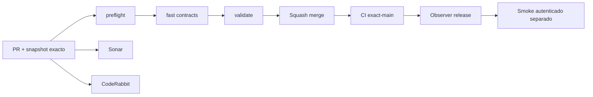

# GrindFlow — Último deploy

> **Snapshot v0.1.45: solo el deploy actual, protección de sesión y vistas privadas Symfony S1.** Base `main` v0.1.44 `788204a5fc18064acf0a259e55c53f90cb9d4bd8`. Selector y panel privados prohíben caché; al revocarse la sesión o membresía durante un guardado React oculta el workspace. CSRF inválido muestra error recuperable sin ocultarlo. Symfony aún no desplegado en Hostinger.

## Progress convention
- ✅ ~~Completado~~ = verificado; 🚧 Pendiente = en curso; ⛔ bloqueado = dependencia externa.

## Fuentes de verdad
[AGENTS.md](AGENTS.md) · [Spec](docs/GRINDFLOW-SPEC.md) · [Requisitos](docs/REQUIREMENTS.md) · [Transición](docs/STACK-TRANSITION-SYMFONY.md) · [Roadmap #2](https://github.com/pl0n3r/GrindFlow/issues/2)

## Estado del deploy
| Señal | Estado | Evidencia |
| --- | --- | --- |
| Version objetivo | 🚧 **v0.1.45** | `config/version.php` |
| Base exacta | ✅ ~~main v0.1.44~~ | `788204a5fc18064acf0a259e55c53f90cb9d4bd8` |
| CI del PR | 🚧 Head final pendiente | `GrindFlow CI / validate` |
| Sonar | 🚧 Pendiente | SonarCloud PR |
| CodeRabbit | 🚧 Revisión por comprobar | PR |
| CI del SHA exacto de main | 🚧 Después del merge | CI PR no lo sustituye |
| Deploy Observer | 🚧 Release humano por observar | No prueba Symfony en remoto |
| Production Smoke | ⛔ Credencial E2E productiva pendiente | [Issue #1](https://github.com/pl0n3r/GrindFlow/issues/1) |
| Symfony S1 en Hostinger | ⛔ NO desplegado | Solo entorno aislado CI |
| Migraciones | ✅ ~~Ningún esquema productivo modificado~~ | DB Symfony descartable |

## Huella del cambio
<!-- grindflow:git-delta -->
| Archivos | Inserciones | Eliminaciones | Neto |
| ---: | ---: | ---: | ---: |
| **7** | **+84** | **−24** | **+60** |

## Calidad y entrega
<!-- grindflow:gate-plan -->
| Control | Estado / contrato |
| --- | --- |
| Gates seleccionados | **preflight · fast[contracts] · symfony-preview** |
| Alcance | Symfony S1: no-store/private y acceso revocado frente a CSRF recuperable |
| Revisiones | CI/Sonar/CodeRabbit, exact-main y Hostinger son independientes |

## Flujo de entrega

## Qué se hizo
- Selector y panel Symfony envían `Cache-Control: no-store, private`; la API de contexto conserva ambas directivas.
- Ante 401/403/409 por pérdida de acceso al cambiar nombres de perfil u organización, React oculta el workspace y ofrece volver al selector.
- Un `invalid_csrf` 403 conserva el panel y muestra el error recuperable sin confundirlo con revocación.
- Pruebas PHP verifican las cabeceras y Chromium móvil recorre CSRF y revocación; no se cambian datos productivos.

## Archivos modificados en este deploy
- `README.md`
- `config/version.php`
- `symfony/frontend/admin/AdminApp.tsx`
- `symfony/src/Http/Controller/AdminController.php`
- `symfony/src/Http/Controller/OrganizationController.php`
- `symfony/tests/e2e/preview.spec.mjs`
- `symfony/tests/php/IdentityLoginTest.php`

## Validación
- Los tests PHP/MariaDB y Chromium se comprueban en CI del PR; sin checkout local en esta sesión.
- Sonar, CodeRabbit, CI exact-main y validación remota son señales independientes; no hay cutover ni migración productiva.

## Qué sigue
[Roadmap canónico #2](https://github.com/pl0n3r/GrindFlow/issues/2)

| Lane | Trabajo | Estado |
| --- | --- | --- |
| **NOW** | 🚧 Validar protección de sesión Symfony S1 v0.1.45 | 🚧 CI y revisión |
| **NEXT** | 🚧 Storage durable, backup y purga con política explícita | 🚧 Después de validar deduplicación |
| **LATER** | 🚧 Vault móvil → reglas → distribución autorizada → piloto | 🚧 Planificado |
| **BLOCKED / EXTERNAL** | ⛔ Cutover sin paridad/datos migrados; Smoke sin credencial | ⛔ Dependencia externa |

## Panorama general pendiente
| Lane | Frente | Estado |
| --- | --- | --- |
| **DONE** | ✅ ~~Dashboard Laravel v0.1.30~~ | ✅ ~~Esquema Symfony S1 v0.1.31~~ |
| **NOW** | 🚧 Validar protección de sesión Symfony S1 v0.1.45 | 🚧 CI y revisión |
| **NEXT** | 🚧 Storage durable, backup y retención | 🚧 Después de validar deduplicación |
| **LATER** | 🚧 Automatización de contenido | 🚧 S2–S5 |
| **BLOCKED / EXTERNAL** | ⛔ Sin cutover Symfony | ⛔ Sin credencial Smoke |
