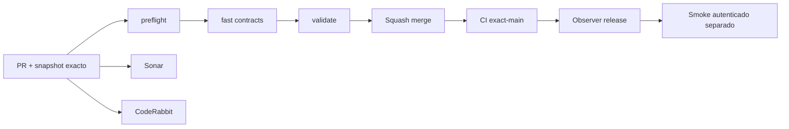

# GrindFlow — Último deploy

> **Candidato v0.1.52: cabeceras de privacidad para rutas Symfony, todavía no desplegado.** La lectura «solo el deploy actual» corresponde al runtime Laravel observado; los cambios Symfony siguen aislados. Base `main` v0.1.51 `ff63576bdf877a31ed0e53087628d19f32c35e47`, CI exact-main success. Evita almacenar login, área privada y API, incluso ante redirecciones y errores. Symfony aún no desplegado en Hostinger.

## Progress convention
- ✅ ~~Completado~~ = verificado; 🚧 Pendiente = en curso; ⛔ bloqueado = dependencia externa.

## Fuentes de verdad
[AGENTS.md](AGENTS.md) · [Spec](docs/GRINDFLOW-SPEC.md) · [Requisitos](docs/REQUIREMENTS.md) · [Transición](docs/STACK-TRANSITION-SYMFONY.md) · [Roadmap #2](https://github.com/pl0n3r/GrindFlow/issues/2)

## Estado del deploy
| Señal | Estado | Evidencia |
| --- | --- | --- |
| Version objetivo | 🚧 **v0.1.52** | `config/version.php` |
| Base exacta | ✅ ~~main v0.1.51~~ | `ff63576bdf877a31ed0e53087628d19f32c35e47` |
| CI del PR | 🚧 Validación del nuevo head pendiente | `GrindFlow CI / validate` |
| Sonar | 🚧 Pendiente | SonarCloud PR |
| CodeRabbit | 🚧 Hallazgos atendidos; revalidación pendiente | PR |
| CI del SHA exacto de main | 🚧 Después del merge | CI PR no lo sustituye |
| Deploy Observer | 🚧 Release humano por observar | No prueba Symfony en remoto |
| Production Smoke | ⛔ Credencial E2E productiva pendiente | [Issue #1](https://github.com/pl0n3r/GrindFlow/issues/1) |
| Symfony S1 en Hostinger | ⛔ NO desplegado | Solo entorno aislado CI |
| Migraciones | ✅ ~~Ningún esquema productivo modificado~~ | DB Symfony descartable |

## Huella del cambio
<!-- grindflow:git-delta -->
| Archivos | Inserciones | Eliminaciones | Neto |
| ---: | ---: | ---: | ---: |
| **4** | **+44** | **−22** | **+22** |

## Calidad y entrega
<!-- grindflow:gate-plan -->
| Control | Estado / contrato |
| --- | --- |
| Gates seleccionados | **preflight · fast[contracts] · symfony-preview** |
| Alcance | Respuesta no almacenable en rutas privadas Symfony, incluidos errores y redirecciones |
| Revisiones | CI/Sonar/CodeRabbit, exact-main y Hostinger son independientes |

## Flujo de entrega

## Qué se hizo
- El suscriptor HTTP aplica `Cache-Control: no-store, private` a `/login`, `/logout`, `/admin`, `/organizations` y `/api/admin` (y sus subrutas), incluso ante redirecciones y errores.
- Se preservan CSP, políticas más estrictas de privacidad y cabeceras de archivos privados ya existentes. Las rutas públicas no reciben esta nueva restricción.
- PHPUnit comprueba que login, redirección del admin, selección de organización, API sin sesión y ruta privada inexistente no sean cacheables; el home público conserva su contrato.

## Archivos modificados en este deploy

Este inventario corresponde al **cambio candidato en el PR**, no a archivos desplegados en Hostinger.
- `README.md`
- `config/version.php`
- `symfony/src/Infrastructure/Http/SecurityHeadersSubscriber.php`
- `symfony/tests/php/PreviewTest.php`

## Validación
- El nuevo caso PHPUnit Symfony se comprueba en CI del PR; sin checkout local en esta sesión.
- CI exact-main v0.1.51 success; CI/Sonar/CodeRabbit del head v0.1.52 y Hostinger son señales separadas. Sin migraciones ni cutover Symfony.

## Qué sigue
[Roadmap canónico #2](https://github.com/pl0n3r/GrindFlow/issues/2)

| Lane | Trabajo | Estado |
| --- | --- | --- |
| **NOW** | 🚧 Validar privacidad HTTP Symfony v0.1.52 | 🚧 CI y revisión |
| **NEXT** | 🚧 Storage durable, backup y purga con política explícita | 🚧 Pendiente de definir política de retención y backup |
| **LATER** | 🚧 Vault móvil → reglas → distribución autorizada → piloto | 🚧 Planificado |
| **BLOCKED / EXTERNAL** | ⛔ Cutover sin paridad/datos migrados; Smoke sin credencial | ⛔ Dependencia externa |

## Panorama general pendiente
| Lane | Frente | Estado |
| --- | --- | --- |
| **DONE** | ✅ ~~Dashboard Laravel v0.1.30~~ | ✅ ~~Esquema Symfony S1 v0.1.31~~ |
| **NOW** | 🚧 Validar privacidad HTTP Symfony v0.1.52 | 🚧 CI y revisión |
| **NEXT** | 🚧 Storage durable, backup y retención | 🚧 Pendiente de definir política de retención y backup |
| **LATER** | 🚧 Automatización de contenido | 🚧 S2–S5 |
| **BLOCKED / EXTERNAL** | ⛔ Sin cutover Symfony | ⛔ Sin credencial Smoke |
