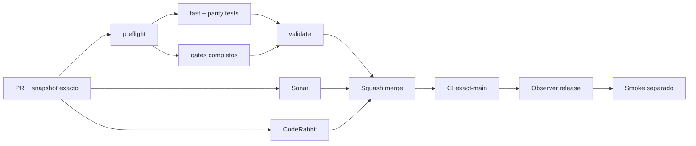

# GrindFlow — Último deploy

> **Candidato v0.1.110: destino estable de teclado en admin Symfony.** Base exacta `main` v0.1.109 `b597640440b579fae585d255ccbeda3e5bdf20fd`; el contenido principal existe desde Twig y conserva el foco durante la hidratación React.

## Progress convention
- ✅ ~~Completado~~ = verificado; 🚧 Pendiente = en curso; ⛔ bloqueado = dependencia externa.

## Fuentes de verdad
[AGENTS.md](AGENTS.md) · [Spec](docs/GRINDFLOW-SPEC.md) · [Requisitos](docs/REQUIREMENTS.md) · [Transición](docs/STACK-TRANSITION-SYMFONY.md) · [Roadmap #2](https://github.com/pl0n3r/GrindFlow/issues/2)

## Estado del deploy
| Señal | Estado | Evidencia |
| --- | --- | --- |
| Version objetivo | 🚧 **v0.1.110** | `config/version.php`; no publicada |
| Base exacta | ✅ ~~main v0.1.109~~ | `b597640440b579fae585d255ccbeda3e5bdf20fd` |
| CI del PR | 🚧 Pendiente | Exigir `validate` del HEAD final |
| Sonar del PR | 🚧 Pendiente | Exigir Quality Gate del HEAD final |
| CodeRabbit del PR | 🚧 Pendiente | Exigir revisión disponible del HEAD final |
| CI del SHA exacto de main | ✅ **VALIDATED IN CODE** | `35838201609` success sobre `b597640440b579fae585d255ccbeda3e5bdf20fd` |
| Deploy Observer | ✅ ~~Marcador humano observado~~ | `35838201490` success; no acredita SHA remoto |
| Production Smoke | ⛔ Login E2E no validado | `35838201643` failure, #73; independiente |
| Symfony en Hostinger | ⛔ NO desplegado | Sin cutover |
| Datos productivos | ✅ ~~No tocados~~ | Symfony/MariaDB/Chromium descartable; sin cuentas reales |

## Huella del cambio
<!-- grindflow:git-delta -->
| Archivos | Inserciones | Eliminaciones | Neto |
| ---: | ---: | ---: | ---: |
| **9** | **+161** | **−65** | **+96** |

## Calidad y entrega
<!-- grindflow:gate-plan -->
| Control | Estado / contrato |
| --- | --- |
| Gates seleccionados | **preflight · fast[operational contracts + automation syntax + README dashboard] · symfony-preview** |
| Gate agregador obligatorio | **validate**: todos los seleccionados; Sonar y CodeRabbit aparte |
| Alcance | GF-UX-008: destino admin estable antes/durante/después de hidratar React a 360/820 px |
| Revisiones | CI/Sonar/CodeRabbit HEAD; exact-main, Observer y Smoke separados |

## Flujo de entrega

## Qué se hizo
- El panel autenticado crea `main#contenido[tabindex="-1"]` en Twig antes de montar React; «Saltar al contenido» ya no depende de que termine la petición de contexto.
- React deja de crear un segundo `main`, evitando landmarks anidados; el mismo nodo conserva el foco cuando el workspace carga o cuando el contexto devuelve 401.
- El fallback `noscript` permanece dentro del contenido principal y el landmark conserva el margen de desplazamiento de navegación.
- PHPUnit valida el HTML autenticado y Chromium sintético comprueba foco estable, único `main` y ausencia de overflow a 360/820 px. GF-UX-008 queda documentado sin alterar sesiones, permisos, CSRF, Laravel ni Hostinger.

## Archivos modificados en esta entrega candidata
Inventario exclusivo de esta entrega candidata; no prueba publicación:
<!-- grindflow:changed-files -->
- `README.md`
- `config/version.php`
- `docs/REQUIREMENTS.md`
- `symfony/frontend/admin/AdminApp.tsx`
- `symfony/frontend/admin/workspace-navigation.css`
- `symfony/templates/identity/admin.html.twig`
- `symfony/tests/e2e/admin-stable-skip.spec.mjs`
- `symfony/tests/e2e/preview.spec.mjs`
- `symfony/tests/php/OrganizationSelectorAccessibilityTest.php`

## Validación
- Exigir `validate`, Sonar y revisión disponible del HEAD final; después CI exact-main.
- `symfony-preview` valida PHPUnit HTTP/MariaDB descartable y Chromium de hidratación admin a 360/820 px.
- La versión humana no acredita deploy Symfony ni resuelve Production Smoke #73.

## Qué sigue
[Roadmap canónico #2](https://github.com/pl0n3r/GrindFlow/issues/2)

| Lane | Trabajo | Estado |
| --- | --- | --- |
| **NOW** | 🚧 Destino estable de teclado en admin | 🚧 v0.1.110 candidata |
| **NEXT** | 🚧 Verificación autorizada de cuenta E2E | 🚧 #2 |
| **LATER** | 🚧 Conmutación Symfony por módulo | 🚧 Sin deploy |
| **BLOCKED / EXTERNAL** | ⛔ Resolver login E2E productivo | ⛔ #73 |

## Panorama general pendiente
| Lane | Frente | Estado |
| --- | --- | --- |
| **DONE** | ✅ ~~v0.1.109 fusionada~~ | ✅ ~~teclado y foco visible en superficies Symfony~~ |
| **NOW** | 🚧 Landmark admin estable durante hidratación | 🚧 GF-UX-008, v0.1.110 |
| **NEXT** | 🚧 Evidencia revisada fuera de banda + autorización separada | 🚧 GF-ARCH-002 sin cutover |
| **LATER** | 🚧 Symfony en Hostinger | 🚧 No desplegado |
| **BLOCKED / EXTERNAL** | ⛔ Smoke autenticado Laravel | ⛔ #73 |
