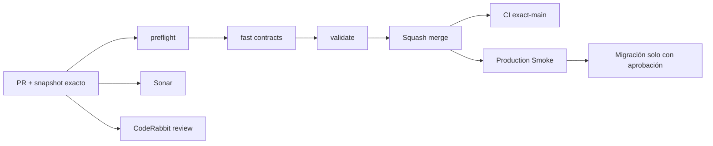

# GrindFlow — Último deploy

  
  
  

> **Development dashboard** · snapshot profesional de **solo el deploy actual**. CI, deploy y validación en producción son evidencias distintas.

## Estado del deploy

| Señal | Estado actual | Evidencia |
| --- | --- | --- |
| Work line | ✅ **GF-OPS · Production Smoke migration blocker** | MERGED en `main` por PR #81 |
| Feature merge commit | ✅ **main** | `fc49d79f61394e7d16050f4f54bcb340ea5ba6fa` |
| CI del PR | ✅ **GrindFlow CI #348** | fast, PHP quality, PHPUnit, MariaDB, browser, legacy y validate |
| Sonar | ✅ **Quality Gate OK** | 0 issues / 0 hotspots en PR #81 |
| CodeRabbit | 🟠 **pending al merge** | no se atribuye aprobación final no emitida |
| CI del SHA exacto de main | ⚪ **sin evidencia confirmada** | CI de PR y exact-main son distintos |
| Production Smoke | 🟠 **pendiente de evidencia exact-main** | issue #69 sigue abierto; último Smoke visible corresponde a `6464a8a0…` |
| Migraciones | 🟠 **no ejecutadas por este cambio** | backup externo y aprobación son acciones del operador |

## Huella del cambio

<!-- grindflow:git-delta -->

| Archivos | Inserciones | Eliminaciones | Neto |
| ---: | ---: | ---: | ---: |
| **1** | **+37** | **−45** | **-8** |

La huella se calcula con `git diff --numstat`; CI rechaza este dashboard si queda desactualizado.

## Calidad y entrega

<!-- grindflow:gate-plan -->

| Control | Estado / contrato |
| --- | --- |
| Gates seleccionados | **preflight · fast[contracts]** |
| GrindFlow CI | docs-only: contrato y dashboard exacto |
| Sonar | revisión documental independiente |
| CodeRabbit | revisión documental no sustituye revisión del feature |
| Migración | ninguna migración se ejecuta desde este PR |
| Producción | ningún cambio de runtime desde este PR documental |

## Flujo de entrega

## Qué se hizo

- Registra el squash merge del clasificador de Production Smoke como `fc49d79f…`.
- Conserva CI #348 y Sonar del PR #81 como evidencia de feature, separada de exact-main.
- El nuevo Smoke informa `MIGRATIONS_PENDING=N` y abandona el retry cuando detecta bloqueo por esquema.
- Conserva el test de tres casos ejecutado con curl simulado, sin requests externas.
- El último incidente conocido sigue en issue #69; no se infiere que el nuevo main haya sido desplegado.
- No cambia runtime, schema, secrets, backups ni contenido productivo desde este PR documental.

## Archivos modificados en este deploy

- `README.md` — snapshot posterior al merge y siguiente frente operativo.

## Validación

- PR #81 fue fusionado en `fc49d79f61394e7d16050f4f54bcb340ea5ba6fa`.
- CI #348 pasó sobre el head del PR `4a5528b5bef8a56f4e838ed55a1b658496f7318e`.
- Sonar reportó Quality Gate OK, 0 issues y 0 hotspots. CodeRabbit estaba pending al merge y sin threads abiertos.
- La última evidencia del issue #69 es del main anterior, no del nuevo SHA.
- No se verificó un backup restaurable desde GrindFlow ni se ejecutaron migraciones en producción.
- Exact-main CI y Production Smoke siguen como evidencia separada.

## Qué sigue

| Lane | Trabajo |
| --- | --- |
| **NOW** | Confirmar CI exact-main y Production Smoke del commit `fc49d79f…`. |
| **NEXT** | Revisar inventario, checksum del lote y backup externo restaurable en Admin > System. |
| **NEXT** | Ejecutar migraciones solo tras aprobación explícita del operador y volver a ejecutar Smoke. |
| **BLOCKED / EXTERNAL** | Storage S3, FFmpeg y configuración Hostinger. |
| **LATER** | Providers reales en sandbox y conciliación Finance. |

## Panorama general pendiente

| Lane | Frente | Estado |
| --- | --- | --- |
| **NOW** | Exact-main delivery | PR #81 MERGED; CI y Smoke de merge por confirmar |
| **NEXT** | Migration readiness producción | backup externo + inventario + aprobación |
| **NEXT** | Scheduling/Distribution/Traffic/Finance | migraciones productivas pendientes |
| **BLOCKED / EXTERNAL** | Hosting/storage | S3 + FFmpeg |
| **LATER** | Provider adapters | sandbox y credenciales cifradas |
| **LATER** | Legacy retirement | tras GF-MIG |
