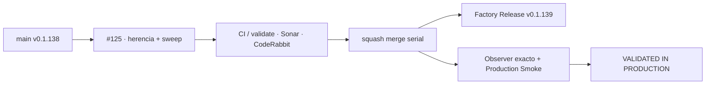

# GrindFlow — Último deploy

> **Candidata v0.1.139 · Issue #125.** Completa otro corte de gobernanza: herencia segura de clasificación en PR y barrido diario idempotente.

## Progress convention
- ✅ ~~Completado~~ = verificado; 🚧 Pendiente = en curso; ⛔ bloqueado = dependencia externa.

## Fuentes de verdad
[AGENTS.md](AGENTS.md) · [Spec](docs/GRINDFLOW-SPEC.md) · [Requisitos](docs/REQUIREMENTS.md) · [Roadmap #2](https://github.com/pl0n3r/GrindFlow/issues/2)

## Estado del deploy
| Señal | Estado | Evidencia |
| --- | --- | --- |
| SHA exacto de main (base) | ✅ **1769f9181925fb6792713696df9091b2f83b9c05** | v0.1.138 |
| CI del SHA exacto de main (base) | ✅ **success** | GrindFlow CI |
| Deploy Observer base | ✅ **success** | SHA 1769f918… |
| Production Smoke base | ✅ **success** | SHA 1769f918… |
| Version objetivo | 🚧 **v0.1.139** | PHP, npm y lock en paridad |
| CI/Sonar/CodeRabbit del PR | 🚧 nueva ronda requerida | HEAD corregido · Issue #125 |
| Producción objetivo | 🚧 pendiente | Observer exacto + Smoke tras merge |

## Huella del cambio
<!-- grindflow:git-delta -->
| Archivos | Inserciones | Eliminaciones | Neto |
| ---: | ---: | ---: | ---: |
| **11** | **+770** | **−40** | **+730** |

## Calidad y entrega
<!-- grindflow:gate-plan -->
| Control | Estado / contrato |
| --- | --- |
| Gates seleccionados | **preflight · fast[operational contracts + automation syntax + README dashboard] · php-quality · PHPUnit · MariaDB · browser · real-stack · legacy · symfony-preview** |
| PR + snapshot exacto | **Issue #125 · v0.1.139**; diff y README deben coincidir con HEAD final |
| Gate agregador obligatorio | **validate** conserva matriz completa + privacidad; Sonar, CodeQL y CodeRabbit separados |
| Release Factory v1 | Solo push main; tag anotado y GitHub Release no prueban producción |
| CI local canónico | **GrindFlow CI / validate** |
| Rol del PR | **Infraestructura · Seguridad · QA** |

## Flujo de entrega

## Qué se hizo
- Hereda únicamente tipo(s) y prioridad canónicos desde un único `Closes #N` cuando faltan en la PR.
- Nunca copia estado del Issue ni etiquetas arbitrarias; una PR sin estado recibe `estado: en revisión` incluso sin `Closes #N`.
- El workflow usa código de la base confiable y metadata GitHub; no ejecuta el HEAD del PR.
- Añade barrido diario/dispatch que mantiene un único `[AUTO] Ítems sin etiquetas`, deduplica reportes y lo cierra cuando llega a cero.
- El reporte automático publica solo número, clase y dimensión controlada; no títulos ni cuerpos de usuario.
- Branch protection sigue sin poder verificarse por esta integración (403); no se declara resuelto en este slice.

## Archivos modificados en esta entrega candidata
<!-- grindflow:changed-files -->
- `.github/workflows/barrido-etiquetas.yml`
- `.github/workflows/grindflow-ci.yml`
- `.github/workflows/heredar-etiquetas-pr.yml`
- `README.md`
- `config/version.php`
- `package-lock.json`
- `package.json`
- `scripts/label-sweep.py`
- `scripts/pr-label-inheritance.py`
- `tests/test_label_sweep.py`
- `tests/test_pr_label_inheritance.py`

## Validación
- Tests offline cubren parser `Closes` (incluidos duplicados), herencia, separadores no canónicos, conflictos, sanitización, deduplicación y cero pendientes.
- Workflow de PR usa `pull_request`, checkout del SHA base y permisos acotados.
- Workflow de sweep usa `schedule`/dispatch, concurrencia serial e idempotencia.
- No cambia runtime, Hostinger, base de datos, secretos ni datos productivos.

## Qué sigue
[Roadmap canónico #2](https://github.com/pl0n3r/GrindFlow/issues/2)

## Panorama general pendiente
| Lane | Frente | Estado |
| --- | --- | --- |
| **NOW** | 🚧 #125/#129 · completar adopción Factory | 🚧 candidata v0.1.139 |
| **NEXT** | 🚧 #140 · Rector/PHPStan y #127 recuperación admin | 🚧 después de TANDA 2 |
| **BLOCKED / EXTERNAL** | ⛔ #139 Dependabot + #146 media storage | ⛔ dependencias externas |
| **LATER** | 🚧 #138 Sentry y producto | 🚧 preservado |
