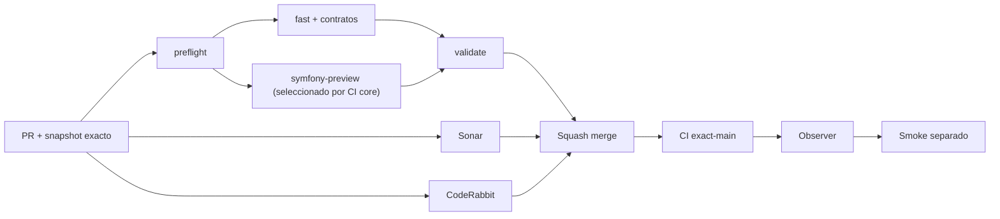

# GrindFlow — Último deploy

> **Candidato v0.1.121: verificación de revisión terminal CodeRabbit sobre el SHA exacto.** Base `main` v0.1.120 `cd871630d427f97a09d9e6e8befdd4e85e1d7a05`; candidata no fusionada ni desplegada.

## Progress convention
- ✅ ~~Completado~~ = verificado; 🚧 Pendiente = en curso; ⛔ bloqueado = dependencia externa.

## Fuentes de verdad
[AGENTS.md](AGENTS.md) · [Spec](docs/GRINDFLOW-SPEC.md) · [Requisitos](docs/REQUIREMENTS.md) · [Transición](docs/STACK-TRANSITION-SYMFONY.md) · [Roadmap #2](https://github.com/pl0n3r/GrindFlow/issues/2)

## Estado del deploy
| Señal | Estado | Evidencia |
| --- | --- | --- |
| Version objetivo | 🚧 **v0.1.121** | `config/version.php`; candidata, no publicada |
| Base exacta | ✅ ~~main v0.1.120~~ | `cd871630d427f97a09d9e6e8befdd4e85e1d7a05` |
| CI del PR | 🚧 Pendiente | `validate` sobre HEAD final |
| Sonar del PR | 🚧 Pendiente | Quality Gate sobre HEAD final, tras cambio de base |
| CodeRabbit del PR | 🚧 Pendiente | Revisión terminada del mismo SHA |
| CI del SHA exacto de main | ✅ ~~success~~ | #35917304166 sobre `cd871630…` |
| Deploy Observer base | ✅ ~~Release observado~~ | #35917304167; no acredita SHA remoto |
| Production Smoke | ⛔ Bloqueo externo #73 | #35917304261 failure |
| Symfony en Hostinger | ⛔ NO desplegado | Sin cutover |
| Datos productivos | ✅ ~~No tocados~~ | Solo CI, script local, tests, docs y versión |

## Huella del cambio
<!-- grindflow:git-delta -->
| Archivos | Inserciones | Eliminaciones | Neto |
| ---: | ---: | ---: | ---: |
| **7** | **+423** | **−26** | **+397** |

## Calidad y entrega
<!-- grindflow:gate-plan -->
| Control | Estado / contrato |
| --- | --- |
| Gates seleccionados | **preflight · fast[operational contracts + automation syntax + README dashboard] · php-quality · PHPUnit · MariaDB · browser · real-stack · legacy · symfony-preview** |
| Gate agregador obligatorio | **validate**: todos los seleccionados; Sonar y CodeRabbit aparte |
| Alcance | Gobierno: evidencia terminal CodeRabbit exact-head, no confundir `skipped` con `completed` |
| Revisiones | CI/Sonar/CodeRabbit HEAD; exact-main, Observer y Smoke separados |

## Flujo de entrega

## Qué se hizo
- `scripts/coderabbit-final-review.py` verifica evidencia GitHub capturada para un HEAD exacto y falla cerrado si CodeRabbit indica `Review skipped`, `pending`, SHA distinto o hilos sin resolver.
- Diecinueve tests offline cubren revisión final real, SHA, hilos, registros malformados, límites de tamaño, FIFO, enlaces simbólicos y UTF-8 inválido; `fast` los ejecuta.
- `docs/CODERABBIT-FINAL-REVIEW.md` y AGENTS explican que es ayuda local, no ruleset, fusión automática ni acreditación productiva.

## Archivos modificados en esta entrega candidata
Inventario de esta entrega candidata, no prueba publicación:
<!-- grindflow:changed-files -->
- `.github/workflows/grindflow-ci.yml`
- `AGENTS.md`
- `README.md`
- `config/version.php`
- `docs/CODERABBIT-FINAL-REVIEW.md`
- `scripts/coderabbit-final-review.py`
- `tests/test_coderabbit_final_review.py`

## Validación
- La PR #120 está fusionada en `main` v0.1.120, con CI exact-main exitoso; scope CI core completo para esta candidata: `validate`, Sonar y CodeRabbit del HEAD final.
- Production Smoke #73 sigue fallando de forma independiente; no cerrar el incidente por pasar CI.
- El helper no consulta producción, no cambia tokens ni genera ZIP.

## Qué sigue
[Roadmap canónico #2](https://github.com/pl0n3r/GrindFlow/issues/2)

## Panorama general pendiente
| Lane | Frente | Estado |
| --- | --- | --- |
| **NOW** | 🚧 Gate de revisión exact-head v0.1.121 contra main v0.1.120 | 🚧 PR #122 |
| **NEXT** | 🚧 Diagnóstico read-only de autenticación #73/#121 | 🚧 pendiente |
| **BLOCKED / EXTERNAL** | ⛔ Smoke autenticado Laravel | ⛔ #73 |
| **LATER** | 🚧 Cutover Symfony por módulo | 🚧 sin deploy |
