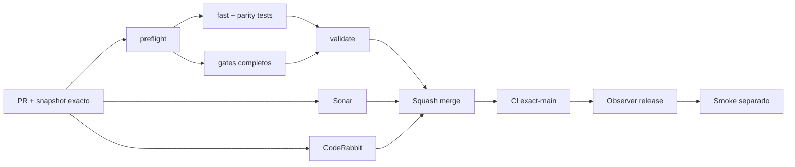

# GrindFlow — Último deploy

> **Candidato v0.1.109: navegación por teclado en Symfony.** Base exacta `main` v0.1.108 `e6d656b7e47f4825ca502134a5781456da4baa6f`; el enlace para saltar al contenido mueve el foco real y los formularios muestran foco visible.

## Progress convention
- ✅ ~~Completado~~ = verificado; 🚧 Pendiente = en curso; ⛔ bloqueado = dependencia externa.

## Fuentes de verdad
[AGENTS.md](AGENTS.md) · [Spec](docs/GRINDFLOW-SPEC.md) · [Requisitos](docs/REQUIREMENTS.md) · [Transición](docs/STACK-TRANSITION-SYMFONY.md) · [Roadmap #2](https://github.com/pl0n3r/GrindFlow/issues/2)

## Estado del deploy
| Señal | Estado | Evidencia |
| --- | --- | --- |
| Versión objetivo | 🚧 **v0.1.109** | `config/version.php`; no publicada |
| Base exacta | ✅ ~~main v0.1.108~~ | `e6d656b7e47f4825ca502134a5781456da4baa6f` |
| CI del PR | 🚧 Pendiente | Exigir `validate` del HEAD final |
| Sonar del PR | 🚧 Pendiente | Exigir Quality Gate del HEAD final |
| CodeRabbit del PR | 🚧 Pendiente | Exigir full review del HEAD final |
| CI del SHA exacto de main | ✅ **VALIDATED IN CODE** | `35834414840` success sobre `e6d656b7e47f4825ca502134a5781456da4baa6f` |
| Deploy Observer | ✅ ~~Marcador humano observado~~ | `35834414868` success; no acredita SHA remoto |
| Production Smoke | ⛔ Login E2E no validado | `35834414871` failure, #73; independiente |
| Symfony en Hostinger | ⛔ NO desplegado | Sin cutover |
| Datos productivos | ✅ ~~No tocados~~ | Symfony/Chromium descartable; sin cuentas reales |

## Huella del cambio
<!-- grindflow:git-delta -->
| Archivos | Inserciones | Eliminaciones | Neto |
| ---: | ---: | ---: | ---: |
| **6** | **+76** | **−20** | **+56** |

## Calidad y entrega
<!-- grindflow:gate-plan -->
| Control | Estado / contrato |
| --- | --- |
| Gates seleccionados | **preflight · fast[operational contracts + automation syntax + README dashboard] · symfony-preview** |
| Gate agregador obligatorio | **validate**: todos los seleccionados; Sonar y CodeRabbit aparte |
| Alcance | GF-UX-007: salto con foco real y controles de formulario visibles a 360/820 px |
| Revisiones | CI/Sonar/CodeRabbit HEAD; exact-main, Observer y Smoke separados |

## Flujo de entrega

## Qué se hizo
- Home Twig, vista previa React, ingreso y selector Symfony hacen enfocable el `main#contenido` para que «Saltar al contenido» lleve el foco al área principal y no solo desplace el viewport.
- El foco de teclado en inputs, selects y textareas recibe el mismo anillo explícito de 3 px que enlaces y botones.
- Chromium aislado navega con Tab/Enter por home, preview y login a 360/820 px; comprueba `document.activeElement`, anillo computado y ausencia de overflow.
- PHPUnit HTTP asegura los destinos de home, preview, login y selector sintético; GF-UX-007 documentado sin tocar sesiones, roles, Laravel ni Hostinger.

## Archivos modificados en esta entrega candidata
Inventario exclusivo de esta entrega candidata; no prueba publicación:
<!-- grindflow:changed-files -->
- `README.md`
- `config/version.php`
- `docs/REQUIREMENTS.md`
- `symfony/public/assets/grindflow.css`
- `symfony/templates/home/index.html.twig`
- `symfony/templates/identity/login.html.twig`
- `symfony/templates/identity/organizations.html.twig`
- `symfony/templates/preview/index.html.twig`
- `symfony/tests/e2e/keyboard-accessibility.spec.mjs`
- `symfony/tests/php/OrganizationSelectorAccessibilityTest.php`
- `symfony/tests/php/PreviewTest.php`

## Validación
- Exigir `validate`, Sonar y revisión final CodeRabbit del HEAD; después CI exact-main.
- `symfony-preview` valida PHPUnit HTTP/MariaDB descartable y Chromium solo con teclado a 360/820 px.
- La versión humana no acredita deploy Symfony ni resuelve Production Smoke #73.

## Qué sigue
[Roadmap canónico #2](https://github.com/pl0n3r/GrindFlow/issues/2)

| Lane | Trabajo | Estado |
| --- | --- | --- |
| **NOW** | 🚧 Navegación por teclado Symfony | 🚧 v0.1.109 candidata |
| **NEXT** | 🚧 Verificación autorizada de cuenta E2E | 🚧 #2 |
| **LATER** | 🚧 Conmutación Symfony por módulo | 🚧 Sin deploy |
| **BLOCKED / EXTERNAL** | ⛔ Resolver login E2E productivo | ⛔ #73 |

## Panorama general pendiente
| Lane | Frente | Estado |
| --- | --- | --- |
| **DONE** | ✅ ~~v0.1.108 fusionada~~ | ✅ ~~movimiento reducido y home sin overflow~~ |
| **NOW** | 🚧 Foco al saltar y foco visible de formularios | 🚧 GF-UX-007, v0.1.109 |
| **NEXT** | 🚧 Evidencia revisada fuera de banda + autorización separada | 🚧 GF-ARCH-002 sin cutover |
| **LATER** | 🚧 Symfony en Hostinger | 🚧 No desplegado |
| **BLOCKED / EXTERNAL** | ⛔ Smoke autenticado Laravel | ⛔ #73 |
