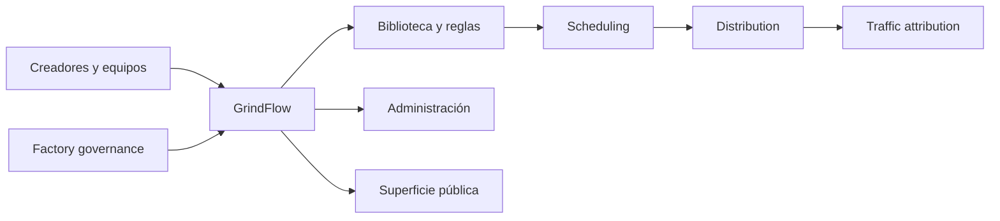

# GrindFlow

> SaaS multi-tenant para gestionar contenido, distribución programada, atribución de tráfico y operaciones de ingresos.

**Rol en la fábrica:** product · **Fase:** construction · **Roadmap:** [GitHub Issue #2](https://github.com/pl0n3r/GrindFlow/issues/2)

**Versión de código declarada:** V0.1.211 · esta etiqueta no prueba despliegue ni salud de producción.
<!-- recovery-sync: issue-307 · base=eb983c17576a0dd1f121870a7c4ee94589824e13 · previous=V0.1.188 -->

GrindFlow ayuda a creadores y equipos a cargar contenido una vez, organizarlo, programar su distribución y medir el tráfico hacia destinos configurados, manteniendo control humano sobre reglas, permisos y publicación.

## Operational Cockpit

<!-- factory:status:start -->
| Señal | Estado |
| --- | --- |
| main SHA | UNKNOWN |
| versión | UNKNOWN |
| CI | UNKNOWN |
| release | UNKNOWN |
| health | UNKNOWN |
| smoke/observer | UNKNOWN |
| quality/security | UNKNOWN |
| Issue activo | UNKNOWN |
| PR activo | UNKNOWN |
| último release | UNKNOWN |
<!-- factory:status:end -->

### Progress + Readiness

<!-- factory:progress-readiness:start -->
| Señal | Estado |
| --- | --- |
| Target | UNKNOWN |
| Progress | UNKNOWN |
| Readiness | UNKNOWN |
| Evidence freshness | UNKNOWN |
| Critical blockers | UNKNOWN |
| Trend | UNKNOWN |

| Dimensión | Progress | Readiness |
| --- | --- | --- |
| UNKNOWN | UNKNOWN | UNKNOWN |
<!-- factory:progress-readiness:end -->

> Los bloques anteriores son derivados. `UNKNOWN` o `PENDING` significa que falta evidencia canónica; nunca se promueve a `GREEN` o `DEGRADED` sin evidencia.

## Work Queue

- **NOW:** [#386 · clasificar HTTP non-200 del readiness S4 post-auth](https://github.com/pl0n3r/GrindFlow/issues/386).
- **NEXT:** [#307 · readiness multimedia](https://github.com/pl0n3r/GrindFlow/issues/307), según la clase HTTP exact-main de #386.
- **LATER:** evolución funcional y transición de stack según el [Roadmap #2](https://github.com/pl0n3r/GrindFlow/issues/2).
- **BLOCKED:** [#139 · vulnerabilidades/dependencias](https://github.com/pl0n3r/GrindFlow/issues/139) y cualquier bloqueo vigente enlazado desde el roadmap.

Esta vista resume el trabajo; no sustituye el roadmap, los Issues ni las Releases.

## Qué hace el producto

GrindFlow gestiona el ciclo de vida de contenido multimedia para equipos y creadores: biblioteca y organización de recursos, programación, distribución a destinos configurados, enlaces rastreables, atribución de tráfico y soporte a operaciones de ingresos. La especificación durable está en [`docs/GRINDFLOW-SPEC.md`](docs/GRINDFLOW-SPEC.md) y los requisitos verificables en [`docs/REQUIREMENTS.md`](docs/REQUIREMENTS.md).

## Arquitectura en 60 segundos


```mermaid
flowchart LR
    U[Creadores y equipos] --> G[GrindFlow]
    G --> C[Biblioteca y reglas]
    C --> S[Scheduling]
    S --> D[Distribution]
    D --> T[Traffic attribution]
    G --> A[Administración]
    G --> P[Superficie pública]
    F[Factory governance] --> G
```

La arquitectura objetivo es un monolito modular API-first. La transición tecnológica conserva el runtime existente hasta demostrar paridad y cutover; el README no convierte un objetivo arquitectónico en estado desplegado.

### Distribution Symfony · provider pilot

En el código candidato **V0.1.211**, Symfony S4 añade un fingerprint determinista de migraciones para el gate backup→recheck y conserva el consumo robusto de `DATABASE_URL` para credenciales percent-encoded y conserva la conexión de Schedule Draft/Composer con el adaptador **Facebook Pages**, el comando local `grindflow:s4:provision-smoke-identity` para reconciliar exclusivamente la identidad sintética reservada del smoke S4 y añade un diagnóstico owner-only de configuración, base, esquema e identidad junto con un runbook de backup, dry-run, migración, provisioning y rollback. Nada de esto se ejecuta automáticamente en producción: la capacidad de publicación **no se considera desplegada** hasta verificar el SHA del checkout productivo, el bridge web y el smoke posterior con evidencia exacta.

## Stack e infraestructura

- **Objetivo backend:** PHP 8.5 + Symfony 7.4 LTS + Doctrine ORM/DBAL/Migrations.
- **Datos:** MariaDB.
- **Administración objetivo:** React + TypeScript + Vite.
- **Público objetivo:** Twig/SSR.
- **Transición:** Laravel y el legado Next.js continúan operativos hasta paridad y cutover verificados.
- **Hosting inicial:** Hostinger, con portabilidad prevista por la arquitectura.
- **CI/gobernanza:** GitHub Actions consumiendo contratos reutilizables de Factory.

La fuente técnica de la transición es [`docs/STACK-TRANSITION-SYMFONY.md`](docs/STACK-TRANSITION-SYMFONY.md); no se infiere estado de producción desde esta sección.

## Ciclo de entrega

Issue → reserva canónica → rama enfocada → PR → gates de GrindFlow/Factory → revisión → squash merge serial → verificación exact-main → release/deploy cuando aplique → smoke/observer → estado operativo basado en evidencia.

Las reglas ejecutables del ciclo están en [`AGENTS.md`](AGENTS.md) y la gobernanza durable en [`docs/GOVERNANCE.md`](docs/GOVERNANCE.md).

## Calidad y seguridad

- `GrindFlow CI / validate` agrega los gates seleccionados por alcance; Sonar y CodeRabbit aportan revisión adicional.
- Los secretos y credenciales viven fuera del repositorio y no se publican en README, Issues ni logs.
- Cambios de datos, despliegue y producción respetan migraciones, backup/restore, rollback y smoke definidos por la documentación operativa.
- Estado desconocido falla cerrado: un badge, una versión o un merge no demuestran por sí solos salud ni despliegue.

Consulta [`AGENTS.md`](AGENTS.md), [`decisiones.yml`](decisiones.yml) y [`docs/GOVERNANCE.md`](docs/GOVERNANCE.md) para las reglas vigentes.

## Roadmap y fuentes de verdad

- **Roadmap canónico:** [Issue #2](https://github.com/pl0n3r/GrindFlow/issues/2).
- **Especificación:** [`docs/GRINDFLOW-SPEC.md`](docs/GRINDFLOW-SPEC.md).
- **Requisitos:** [`docs/REQUIREMENTS.md`](docs/REQUIREMENTS.md).
- **Modelo de desarrollo:** [`docs/DEVELOPMENT-MODEL.md`](docs/DEVELOPMENT-MODEL.md).
- **Decisiones vigentes:** [`decisiones.yml`](decisiones.yml).
- **Contrato operativo para agentes:** [`AGENTS.md`](AGENTS.md).
- **Documentación profunda:** [`docs/`](docs/).

El README enlaza estas fuentes; no las duplica ni funciona como changelog.

## Desarrollo local

Para el frontend/legado Node declarado actualmente en `package.json`:

```bash
npm ci
npm run validate
```

Los comandos y gates PHP/Symfony vigentes se mantienen en [`AGENTS.md`](AGENTS.md) y en la documentación de transición. Ejecuta solo los gates correspondientes al área modificada; no uses una ejecución local como evidencia de producción.

## Mapa de la fábrica

- **Factory:** governance/kit y contratos reutilizables.
- **ControlBot:** control plane privado de proyectos, trabajo, decisiones e incidentes.
- **FactoryRunner:** execution plane.
- **Condor:** producto.
- **GrindFlow:** **producto actual**, enfocado en contenido, distribución y tráfico.
- **BRVTAL:** producto.
- **AutoFactory:** herramienta local/manual.

Cada repositorio conserva su responsabilidad; GrindFlow consume gobernanza de Factory sin convertirse en un segundo control plane.