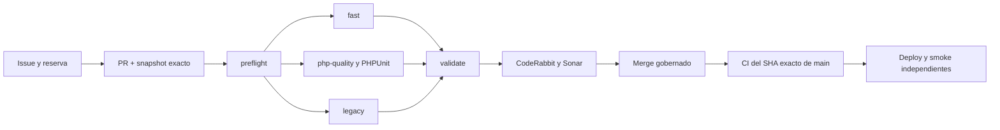

# GrindFlow — Último deploy

## Progress convention

- ✅ ~~Completado~~: integrado y verificado con evidencia propia.
- 🚧 Pendiente: código candidato, verificación o integración todavía incompleta.
- ⛔ Bloqueado: falta una condición comprobable; no significa despliegue exitoso.

## Fuentes de verdad

- [AGENTS.md](AGENTS.md), [gobernanza](docs/GOVERNANCE.md), [especificación](docs/GRINDFLOW-SPEC.md) y [requisitos](docs/REQUIREMENTS.md).
- El histórico acumulativo, las dependencias y las decisiones de producto viven en [Roadmap #2](https://github.com/pl0n3r/GrindFlow/issues/2). Este README es solo el snapshot de entrega.

## Estado del deploy

- Version **v0.1.217**: candidata de código; no equivale a versión desplegada en Hostinger.
- Fase: construcción. Integración y publicación: 🚧 pendiente.
- Base de la propuesta: `main@0760bc1cfab2d388ac7a614256c8f98ef2d5d02f` (V0.1.216).
- Trabajo: seguridad Next.js 15.5.27, [Issue #411](https://github.com/pl0n3r/GrindFlow/issues/411), rama `trabajo/issue-411`.
- CI del SHA exacto de main: no equivale al CI de un PR; verificar tras merge.
- Salud, checkout productivo, /health y smoke posterior de esta versión: UNKNOWN (no inferidos desde el código).

## Huella del cambio

<!-- grindflow:git-delta -->
| Archivos | Inserciones | Eliminaciones | Neto |
| ---: | ---: | ---: | ---: |
| **5** | **+231** | **−133** | **+98** |

## Calidad y entrega

<!-- grindflow:gate-plan -->
| Control | Estado / contrato |
| --- | --- |
| Gates seleccionados | **preflight · fast[operational contracts + automation syntax + README dashboard] · php-quality · PHPUnit · legacy** |
| CI | 🚧 Gate exact-HEAD obligatorio antes de merge |
| CodeRabbit | 🚧 Review sustantiva/cobertura final exact-HEAD obligatoria |
| Sonar | 🚧 Verificar por HEAD exacto, sin inferir de badges |
| Seguridad | Dependabot #410: pin e integridad verificables en test de contrato |

## Flujo de entrega

```mermaid
flowchart LR
 A[Issue y reserva] --> B[PR + snapshot exacto]
 B --> C[preflight]
 C --> D[fast]
 C --> E[php-quality y PHPUnit]
 C --> F[legacy]
 D --> G[validate]
 E --> G
 F --> G
 G --> H[CodeRabbit y Sonar]
 H --> I[Merge gobernado]
 I --> J[CI del SHA exacto de main]
 J --> K[Deploy y smoke independientes]
```

## Qué se hizo

- Preparación del patch de seguridad para Next.js legacy en `package.json` y `package-lock.json`, con integridades originales de Dependabot #410.
- Identidad candidata V0.1.217 sincronizada y test de regresión para impedir volver a 15.5.25.
- Sin activar proveedores, mutar bases de datos ni afirmar cambios productivos.

## Archivos modificados en esta entrega candidata

Inventario verificable por `scripts/readme-dashboard.py`:
<!-- grindflow:changed-files -->
- `README.md`
- `config/version.php`
- `package-lock.json`
- `package.json`
- `tests/test_next_security_lock_contract.py`

## Validación

- En revisión: se requiere `GrindFlow CI / validate`, QA, Sonar, CodeRabbit y comprobación del SHA exacto.
- Reversión: revert del PR; sin migración, compras, secretos ni operación productiva.

## Qué sigue

Consultar el [Roadmap canónico #2](https://github.com/pl0n3r/GrindFlow/issues/2) para dependencias y prioridad real.

## Panorama general pendiente

| Lane | Frente | Estado |
| --- | --- | --- |
| **NOW** | 🚧 Seguridad Next.js 15.5.27 | 🚧 CI / revisión |
| **NEXT** | 🚧 Library: vigencia UTC de assets | 🚧 contrato y nueva versión tras #411 |
| **BLOCKED / EXTERNAL** | ⛔ Evidencia de despliegue y Smoke del candidato | ⛔ no ejecutados |
| **LATER** | 🚧 Resto del MVP y transición completa a Symfony | 🚧 secuenciado |

## Operational Cockpit

<!-- factory:status:start -->
| Señal | Estado |
| --- | --- |
| main SHA | UNKNOWN |
| versión | UNKNOWN |
| CI | UNKNOWN |
| release | UNKNOWN |
| health | UNKNOWN |
| smoke/observer | UNKNOWN |
| quality/security | UNKNOWN |
| Issue activo | UNKNOWN |
| PR activo | UNKNOWN |
| último release | UNKNOWN |
<!-- factory:status:end -->

### Progress + Readiness

<!-- factory:progress-readiness:start -->
| Señal | Estado |
| --- | --- |
| Target | UNKNOWN |
| Progress | UNKNOWN |
| Readiness | UNKNOWN |
| Evidence freshness | UNKNOWN |
| Critical blockers | UNKNOWN |
| Trend | UNKNOWN |

| Dimensión | Progress | Readiness |
| --- | --- | --- |
| UNKNOWN | UNKNOWN | UNKNOWN |
<!-- factory:progress-readiness:end -->

> Estos bloques son derivados del contrato de Factory. UNKNOWN no equivale a GREEN ni autoriza deploy.

## Work Queue

- **NOW:** #411 · estabilizar Next.js legacy 15.5.27 con CI/revisión.
- **NEXT:** #407 · Library, vigencia UTC; revisar serialización y versión libre.
- **LATER:** resto del MVP aprobado en el roadmap.
- **BLOCKED:** fase live, accesos/productivo y terceros conservan puertas independientes.

## Qué hace el producto

Plataforma SaaS para Library, Scheduler, Distribution y Traffic de creadores y equipos, con aislamiento por tenant y permisos. La especificación completa es [GRINDFLOW-SPEC](docs/GRINDFLOW-SPEC.md).

## Arquitectura en 60 segundos

Symfony 7.4 / Doctrine / MariaDB + React/Vite + Twig son el objetivo en construcción. Laravel y Next.js legacy no se retiran sin paridad, cutover y smoke verificados.

## Stack e infraestructura

Hostinger inicial. Next.js 15.5.27 se integra aquí como mantenimiento del legado, sin declarar deploy del nuevo SHA.

## Ciclo de entrega

Issue → reserva → PR gobernado → CI y CodeRabbit → squash merge → CI exact-main → deploy autorizado → smoke real.

## Calidad y seguridad

Los tests de lockfile no sustituyen CodeRabbit, Sonar, política Factory ni controles de privacidad. No hay secretos ni operaciones productivas en este PR.

## Roadmap y fuentes de verdad

[Roadmap maestro](https://github.com/pl0n3r/GrindFlow/issues/2), [AGENTS](AGENTS.md), [Requirements](docs/REQUIREMENTS.md) y [Governance](docs/GOVERNANCE.md).

## Desarrollo local

`npm ci --ignore-scripts --no-audit --no-fund`, `npm run typecheck` y `python3 -m unittest tests/test_next_security_lock_contract.py`, junto con gates seleccionados por CI.

## Mapa de la fábrica

Factory: kit compartido; ControlBot: control plane; FactoryRunner: ejecución; GrindFlow: producto; Condor y BRVTAL: productos; AutoFactory: herramienta local/manual.
